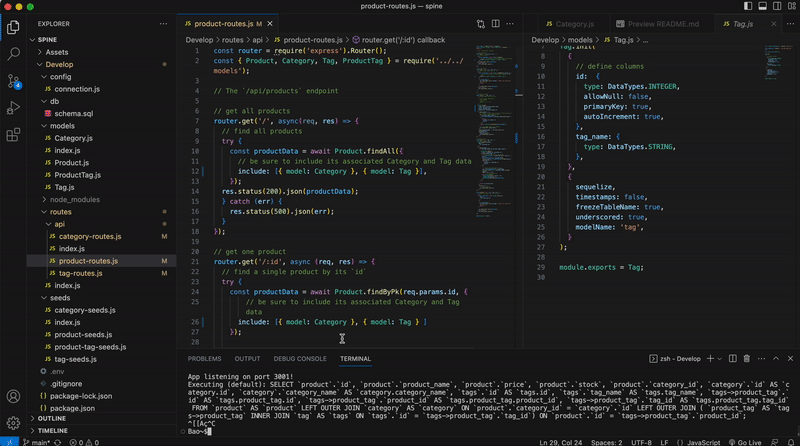
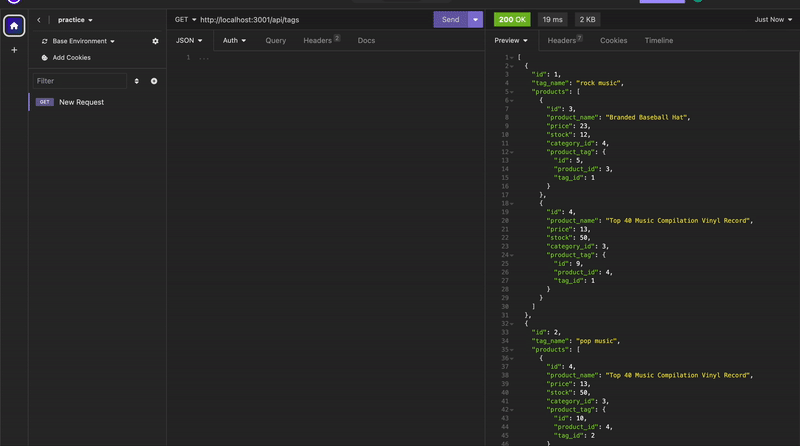

# 13 Object-Relational Mapping (ORM): E-Commerce Back End

## Description

A back end is created for an internet retail company so Express.js  API can interact with a MySQL database using Sequelize. Through this back end, the internet retail company can then easily organize and manage their inventory to compete with other e-commerce companies.

## User Story

```md
AS A manager at an internet retail company
I WANT a back end for my e-commerce website that uses the latest technologies
SO THAT my company can compete with other e-commerce companies
```

## Acceptance Criteria

```md
GIVEN a functional Express.js API
WHEN I add my database name, MySQL username, and MySQL password to an environment variable file
THEN I am able to connect to a database using Sequelize
WHEN I enter schema and seed commands
THEN a development database is created and is seeded with test data
WHEN I enter the command to invoke the application
THEN my server is started and the Sequelize models are synced to the MySQL database
WHEN I open API GET routes in Insomnia for categories, products, or tags
THEN the data for each of these routes is displayed in a formatted JSON
WHEN I test API POST, PUT, and DELETE routes in Insomnia
THEN I am able to successfully create, update, and delete data in my database
```

## Mock-Up

The following animation shows the application's GET routes to return all categories, all products, and all tags being tested in Insomnia:



The following animation shows the application's GET routes to return a single category, a single product, and a single tag being tested in Insomnia:



The following animation shows the application's POST, PUT, and DELETE routes for categories being tested in Insomnia:


The following video shows the application's POST, PUT, and DELETE routes for tags and products being tested in Insomnia:

(https://drive.google.com/file/d/1LMxTTCxMLkMSpcJDqX2mBNSKS6LK1WOv/view?usp=sharing)

## Usage

When a employer answers the prompt, they will be directed to view all departments view all roles, view all employees, add a department, add a role, add an employee, or update an employee role.